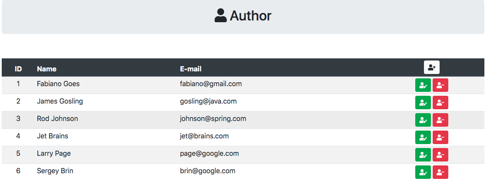
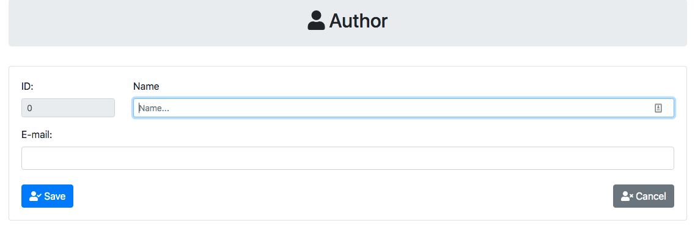

# Spring with Thymeleaf and Kotlin

This project was a study about the Stack:   

* [Kotlin](https://kotlinlang.org/docs/reference/)
* [Gradle](https://docs.gradle.org/current/userguide/userguide.html)
* [Spring Initializr](https://start.spring.io/)
* [Spring Web](https://spring.io/guides/gs/serving-web-content/)
* [Spring Data](https://docs.spring.io/spring-data/jpa/docs/current/reference/html/#reference)
* [H2 Database](http://www.h2database.com/html/grammar.html)
* [Thymeleaf](https://www.thymeleaf.org/doc/tutorials/2.1/thymeleafspring.html)
* [Bean Validation](https://docs.spring.io/spring/docs/4.1.x/spring-framework-reference/html/validation.html)
* [Bootstrap](https://getbootstrap.com/)
* [FontAwesome](https://fontawesome.com)

[Help](HELP.md)

### Running Application
-----------------------

```
./gradlew build && java -jar build/libs/demo-thymeleaf-kotlin-0.0.1-SNAPSHOT.jar
```

> **Open url:** http://localhost:8080   

### Front-end
-------------

**Authos Table**   



**Author Form**   




### Gradle Commands
-------------------

```
./gradlew build
./gradlew test
```

### Referencea

* [Handling Form Submission](https://spring.io/guides/gs/handling-form-submission/)
* [Spring MVC - Using RedirectAttributes](https://www.logicbig.com/tutorials/spring-framework/spring-web-mvc/redirect-attributes.html)
* [Binding a List in Thymeleaf](https://www.baeldung.com/thymeleaf-list)
* [Validating Form Input](https://spring.io/guides/gs/validating-form-input/)
* [Spring Bean Validation Example (JSR-303) in Kotlin](https://stonesoupprogramming.com/2017/06/21/spring-bean-validation-example-jsr-303-in-kotlin/)
* [KotlinBeanValidation Github repository](https://github.com/archer920/KotlinBeanValidation)
* [All You Need To Know About Bean Validation With Spring Boot](https://reflectoring.io/bean-validation-with-spring-boot/)
* [Thymeleaf using path variables to th:href](https://stackoverflow.com/questions/33753975/thymeleaf-using-path-variables-to-thhref)
* [Bootstrap](https://getbootstrap.com/docs/4.5/getting-started/introduction/)
* [FontAwesome](https://fontawesome.com/icons?d=gallery&q=user)